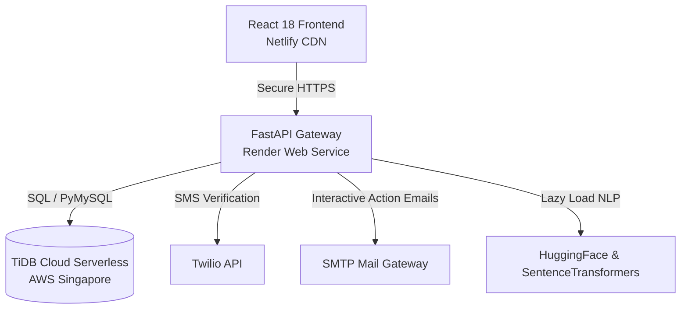

# 🎓 Samarthya: AI-Powered Student Internship Matching & Allocation Platform

[](https://samarthyahere.netlify.app/)
[](https://samarthya-backend.onrender.com/docs)
[](https://tidbcloud.com/)

**Samarthya** is a production-ready, multi-portal web platform (Student, Organization, and Admin) designed to solve the internship allocation problem. It integrates advanced natural language processing (NLP) for resume parsing, semantic skill matching, and a robust implementation of the **Gale-Shapley Stable Matching Algorithm** to ensure optimal, manipulation-free allocations.

---

## 🛠️ System Architecture & Data Flow



---

## 🚀 Key Feature Highlights & Engineering Depth

### 1. Gale-Shapley Stable Matching Engine
At the core of Samarthya is the student-proposing **Gale-Shapley (Deferred Acceptance)** matching algorithm. 
* **Stable Match Guarantee:** Ensures there are no "blocking pairs"—no student and organization prefer each other over their assigned matches, preventing strategic manipulation of preferences.
* **Capacity & Waitlist Caps:** Respects organization quota limits (`MAX_OFFERS = 2`) and waitlist size constraints (`MAX_WAITING = 2`).
* **State Machine & Reallocation:** Dynamically handles student actions (Accept/Reject). Rejecting an offer automatically triggers real-time promotions from the waitlist, updating database states and triggering notifications.

### 2. AI-Powered Resume Parsing & Semantic Scoring
To remove friction during student onboarding, the platform uses a hybrid NLP extraction pipeline:
* **Entity Extraction:** Loads a fine-tuned Hugging Face BERT model (`dslim/bert-base-NER`) to extract academic institutions and structures.
* **Skill Vectorization:** Utilizes `all-MiniLM-L6-v2` SentenceTransformers to vectorize skills. Instead of rigid keyword matching, it computes **Cosine Similarity** between student skills and company requirements.
* **Weighted Multi-Criteria Scoring:**
  $$\text{Score} = (\text{Skills Cosine Sim} \times 0.35) + (\text{Capped CGPA} \times 0.20) + (\text{Preferences} \times 0.20) + (\text{Branch Suitability} \times 0.15) + (\text{Location} \times 0.10)$$
  *Academic CGPA is capped at 8.0 to prevent hyper-academic outlier bias, prioritizing balanced candidate profiles.*

### 3. Deployed Low-Memory Boot Optimization
* **Problem:** Loading PyTorch, Hugging Face transformers, and SentenceTransformers during FastAPI startup consumes over **750MB of RAM**, causing standard cloud server instances (like Render's 512MB Free Tier) to crash due to Out-of-Memory (OOM) errors.
* **Solution:** Re-engineered the backend to use **lazy-loading imports** and runtime module resolution. Heavy packages are only loaded inside specific execution scopes when a user uploads a resume or runs the allocation. 
* **Impact:** Reduced boot RAM footprint by **90%** (to under **90MB**), ensuring stable, cost-effective, and highly scalable cloud deployments.

### 4. Interactive Onboarding & OTP Security
* **Aadhaar OTP Verification:** Integrates the **Twilio API** to deliver secure, SMS-based OTP verifications during onboarding.
* **Interactive SMTP Action Emails:** Dispatches stylized HTML emails to candidates. The email contains encrypted accept/reject links that invoke the API directly from the user's inbox.

---

## 💻 Technology Stack

| Layer | Technologies |
| :--- | :--- |
| **Frontend** | React 18, React Router v6, Tailwind CSS, Axios, Context API |
| **Backend** | FastAPI (Python 3.14), SQLAlchemy ORM, PyMySQL, Pydantic v2 |
| **Machine Learning** | Hugging Face Transformers (`bert-base-NER`), SentenceTransformers (`all-MiniLM-L6-v2`), PyTorch, Scikit-Learn |
| **Database** | TiDB Cloud Serverless (MySQL-compatible distributed cloud database on AWS) |
| **Services** | Twilio SMS Gateway, Google OAuth 2.0, SMTP Mailer |

---

## 📁 Project Directory Layout

```text
Samarthya/
│
├── public/                     # React public files & _redirects config
├── src/                        # React Frontend Source
│   ├── components/             # Dashboards (Student, Company, Admin)
│   ├── context/                # AuthContext (state management & routing)
│   └── index.js                # App entry with production URL interceptors
│
├── backend/                    # FastAPI Backend Source
│   ├── main.py                 # API endpoints & server config
│   ├── match.py                # Gale-Shapley Matching Engine (optimized)
│   ├── utils.py                # Resume parser, spacy & BERT loaders
│   ├── db.py                   # TiDB Cloud Serverless connection
│   ├── requirements.txt        # Production Python dependencies
│   └── .env                    # Local environment settings (ignored by Git)
│
├── README.md                   # Project documentation
└── .gitignore                  # Git ignore rules for envs and pycache
```

---

## 🗄️ Database Schema Summary

The relational database consists of 14 normalized tables. The core tables include:
1. **`users`**: Login credentials and contact details for students.
2. **`student_profiles`**: Academic status (CGPA, degree, branch), technical skills list, family details, and location preferences.
3. **`verification`**: Track student verification status via Aadhaar SMS OTP.
4. **`opportunities`**: Internship listings containing required skills, vacancies, and stipend.
5. **`allocation_scores`**: Calculated multi-criteria match scores for all student-job pairs.
6. **`allocation_status`**: Current matching status (`Allocated`, `Waiting`, `Accepted`, `Rejected`).

---

## ⚡ Local Setup

### 1. Clone the Repository
```bash
git clone https://github.com/patil78/Samarthya.git
cd Samarthya
```

### 2. Configure Environment Variables
Create a `.env` file in the `backend/` directory:
```env
TWILIO_ACCOUNT_SID=your_twilio_sid
TWILIO_AUTH_TOKEN=your_twilio_token
TWILIO_PHONE_NUMBER=your_twilio_phone
SENDER_EMAIL=your_email@gmail.com
EMAIL_PASSWORD=your_app_password
```

### 3. Start Backend Gateway
```bash
cd backend
pip install -r requirements.txt
uvicorn main:app --reload
```
*API Gateway will run at `http://localhost:8000` with interactive Swagger docs at `http://localhost:8000/docs`.*

### 4. Start React Frontend
```bash
cd ..
npm install
npm run dev
```
*Frontend will run at `http://localhost:3000`.*
